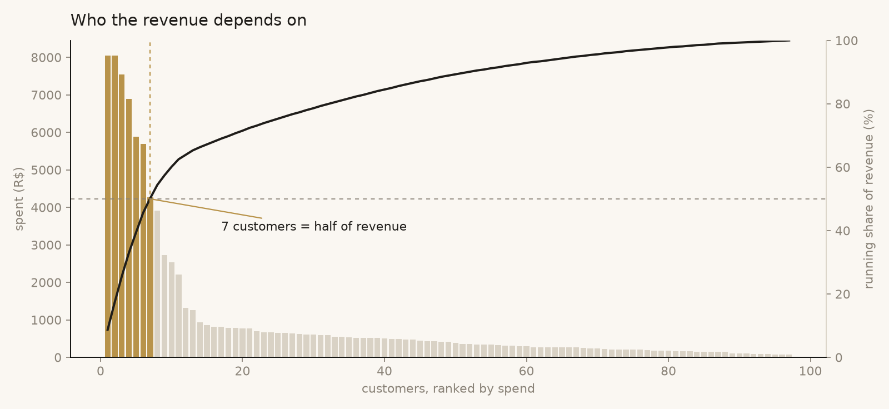
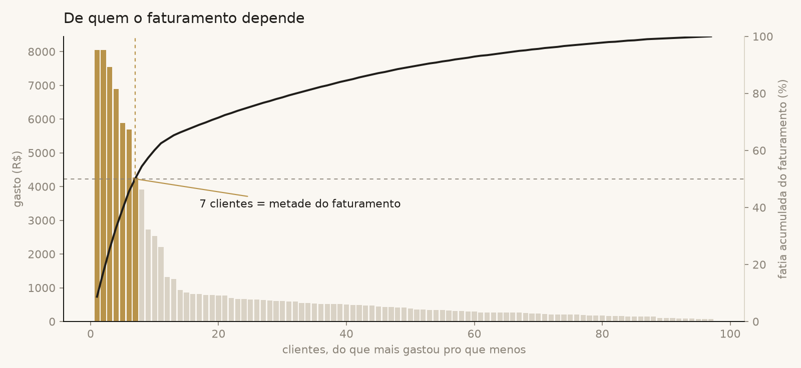

# 01 · How many customers account for half of the revenue?

**The sentence I gave the owner:** *"Seven customers pay for half of everything
we have ever sold. The other ninety split the rest. Losing one of those seven
hurts more than losing ten of the others."*



## Why this question

A small business feels like it has "many customers". The data usually says
something else: a few people carry it. Knowing who they are changes what
you do on Monday: who hears about a launch first, who gets free shipping
once in a while, who gets a message on their birthday, and who you call
when they go quiet.

## How it is answered

[`query.sql`](query.sql), in four steps:

1. **One row per sold item** with the customer attached. Gifts (`status =
   'bonus'`) are excluded: they are a cost, not revenue.
2. **Collapse to one row per customer**: orders, items, total spent.
   `count(distinct order_id)` matters here; an order with three items is
   one order, not three.
3. **Rank by spend** and compute two shares with window functions: the
   customer's own share (`sum() over ()`) and the running share
   (`sum() over (order by spent desc rows unbounded preceding)`).
4. **Read the first row where the running share reaches 50%.** Its position
   is the answer.

The chart is the same table drawn: bars are each customer's spend, the line
is the running share, and the dashed line marks 50%.

## Result on the synthetic data

| position | customer | orders | spent | share | running |
|---|---|---|---|---|---|
| 1 | Helena Correia | 14 | 8,049.58 | 8.7% | 8.7% |
| 2 | Bruno Nunes | 14 | 8,049.26 | 8.7% | 17.4% |
| 3 | Fernanda Cardoso | 14 | 7,542.88 | 8.2% | 25.6% |
| ... | | | | | |
| 7 | Igor Santos | 6 | 4,261.27 | 4.6% | 50.2% |
| 33 | | | | | 80.5% |
| 97 | | | | | 100% |

- **7 of 97 customers = half of the revenue** (R$ 92.4k in total).
- **33 customers = 80%.** The remaining 64 share the last 20%.

The production numbers are different, but the shape is the same: half of
the revenue comes from roughly a tenth of the customers.

## What came out of it

- The seven names became a list the owner keeps. Two of them had not bought
  in over a month; they got a message the same week.
- The same query, filtered by period, went into the management system's
  reports page, so the owner can see "where the money comes from" for any
  month without asking.

## Reproduce

```bash
python scripts/generate_data.py
python scripts/run_analysis.py 01-pareto-customers
```

---

## Em português

# 01 · Quantos clientes respondem por metade do faturamento?



**A frase que eu dei pro dono:** *"Sete clientes pagam metade de tudo que a
gente já vendeu. Os outros noventa dividem o resto. Perder um desses sete dói
mais que perder dez dos outros."*

### Por que essa pergunta

Negócio pequeno sente que tem "muitos clientes". O dado costuma dizer outra
coisa: poucas pessoas carregam. Saber quem são muda o que se faz na segunda
de manhã: quem fica sabendo do lançamento primeiro, quem ganha frete de
cortesia de vez em quando, quem recebe mensagem no aniversário, e pra quem
você liga quando some.

### Como é respondida

[`query.sql`](query.sql), em quatro passos:

1. **Uma linha por item vendido**, com o cliente colado. Bônus (`status =
   'bonus'`) fica de fora: é custo, não receita.
2. **Amassa em uma linha por cliente**: pedidos, itens, total gasto. O
   `count(distinct order_id)` importa: pedido com três itens é um pedido.
3. **Ordena por gasto** e calcula duas fatias com funções de janela: a do
   próprio cliente (`sum() over ()`) e a acumulada
   (`sum() over (order by spent desc rows unbounded preceding)`).
4. **Lê a primeira linha em que o acumulado chega a 50%.** A posição dela é
   a resposta.

O gráfico é a mesma tabela desenhada: as barras são o gasto de cada cliente,
a linha é o acumulado, e o tracejado marca os 50%.

### Resultado nos dados fictícios

- **7 de 97 clientes = metade do faturamento** (R$ 92,4 mil no total).
- **33 clientes = 80%.** Os outros 64 dividem os últimos 20%.

Os números de produção são outros, mas a forma é a mesma: metade do
faturamento vem de mais ou menos um décimo dos clientes.

### O que saiu disso

- Os sete nomes viraram uma lista que o dono guarda. Dois deles estavam há
  mais de um mês sem comprar; receberam mensagem na mesma semana.
- A mesma consulta, com filtro de período, entrou na página de relatórios do
  sistema de gestão: o dono vê "de onde vem o dinheiro" de qualquer mês sem
  precisar perguntar.

