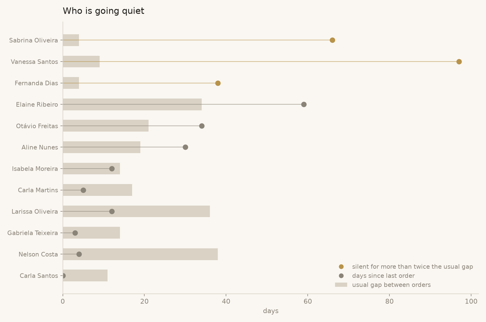
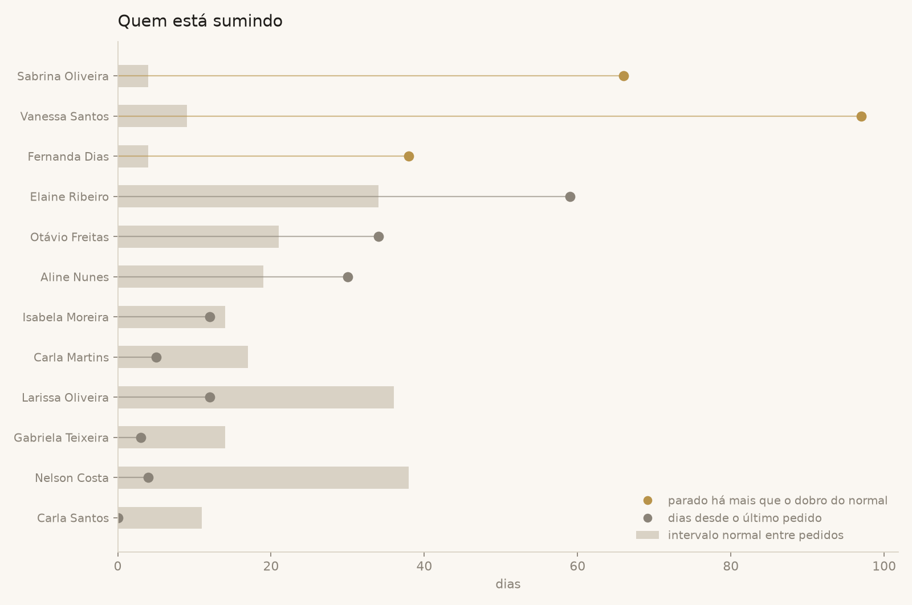

# 02 · Which customers are going quiet?

**The sentence I gave the owner:** *"Three of your eight biggest customers
have stopped. Not 'slowed down': each one used to buy every week or two and
has been silent for more than a month. If you message three people this
week, it is these three."*



## Why this question

"Has not bought in 30 days" is the usual alarm, and it is wrong in both
directions. Someone who buys every week and vanished for a month is a
problem; someone who buys twice a year is right on schedule. The alarm has
to be relative to each customer's own rhythm, otherwise the follow-up list
is noise and the owner stops reading it.

## How it is answered

[`query.sql`](query.sql), in five steps:

1. **One row per order** that had at least one sold item. Gifts (`status =
   'bonus'`) do not count as a purchase. The `group by` collapses the items
   back into their order.
2. **Days since the customer's previous order**, with `lag()`. The window
   is `partition by customer_id order by order_date`, so each customer's
   list is read on its own and the first order gets `null` (nothing before
   it).
3. **One row per customer**: orders, last order, and the usual gap
   (`avg` of the gaps; it ignores the `null` from the first order). Only
   customers with **3 or more orders** stay, via `having`: with one gap
   there is no rhythm to compare against.
4. **"Today" is the last day in the data**, taken with `max(created_at)`
   and attached with `cross join`. That keeps the result identical every
   time it runs; in production it is `current_date`.
5. **Flag whoever has been silent for more than twice their usual gap.**
   The whole list is returned so the chart shows the healthy ones too.

In the chart, the grey bar is how long the customer usually waits between
orders and the dot is how long they have been waiting now. A dot far past
its bar is the person to call.

## Result on the synthetic data

| customer | orders | last order | days silent | usual gap | ratio |
|---|---|---|---|---|---|
| Sabrina Oliveira | 14 | 2026-07-06 | 66 | 4 | 16.5 |
| Vanessa Santos | 14 | 2026-06-05 | 97 | 9 | 10.8 |
| Fernanda Dias | 13 | 2026-08-03 | 38 | 4 | 9.5 |
| Elaine Ribeiro | 6 | 2026-07-13 | 59 | 34 | 1.7 |
| ... | | | | | |

- **12 customers have a rhythm** (3 or more orders). **3 of them went
  quiet**, and all three are in the top 8 of [analysis 01](../01-pareto-customers/).
- Elaine Ribeiro shows why the rule is relative: 59 days silent looks bad,
  but she orders roughly every 34 days, so she is not flagged yet.

## What came out of it

- The flagged names go to the owner as a short list, not a report: name,
  last order, what they used to buy. The message is personal, not a
  campaign.
- The threshold (twice the usual gap) is a choice, not a law. A stricter
  business would use 1.5; the query has one number to change.

## Reproduce

```bash
python scripts/generate_data.py
python scripts/run_analysis.py 02-customers-going-quiet
```

---

## Em português



**A frase que eu dei pro dono:** *"Três dos seus oito maiores clientes
pararam. Não é 'diminuíram': cada um comprava toda semana ou a cada duas, e
está há mais de um mês sem aparecer. Se você mandar mensagem pra três
pessoas essa semana, são essas três."*

### Por que essa pergunta

"Não compra há 30 dias" é o alarme de sempre, e erra pros dois lados. Quem
compra toda semana e sumiu por um mês é problema; quem compra duas vezes
por ano está no prazo. O alarme tem que ser relativo ao ritmo de cada
cliente, senão a lista de contato vira ruído e o dono para de ler.

### Como é respondida

[`query.sql`](query.sql), em cinco passos:

1. **Uma linha por pedido** que teve pelo menos um item vendido. Bônus
   (`status = 'bonus'`) não conta como compra. O `group by` amassa os itens
   de volta no pedido deles.
2. **Dias desde o pedido anterior do cliente**, com `lag()`. A janela é
   `partition by customer_id order by order_date`: a lista de cada cliente
   é lida separada, e o primeiro pedido recebe `null` (não tem nada antes).
3. **Uma linha por cliente**: pedidos, último pedido e intervalo normal
   (`avg` dos intervalos; ele ignora o `null` do primeiro). Só fica quem tem
   **3 pedidos ou mais**, via `having`: com um intervalo só, não existe
   ritmo pra comparar.
4. **"Hoje" é o último dia dos dados**, pego com `max(created_at)` e colado
   com `cross join`. Assim o resultado é o mesmo toda vez que roda; em
   produção é `current_date`.
5. **Marca quem está parado há mais que o dobro do intervalo normal.** A
   lista inteira volta, pra o gráfico mostrar também quem está saudável.

No gráfico, a barra cinza é quanto o cliente costuma esperar entre pedidos
e a bolinha é quanto está esperando agora. Bolinha bem depois da barra é a
pessoa pra chamar.

### Resultado nos dados fictícios

- **12 clientes têm ritmo** (3 pedidos ou mais). **3 deles sumiram**, e os
  três estão no top 8 da [análise 01](../01-pareto-customers/).
- Elaine Ribeiro mostra por que a regra é relativa: 59 dias parada parece
  ruim, mas ela pede mais ou menos a cada 34 dias, então ainda não é
  marcada.

### O que saiu disso

- Os nomes marcados vão pro dono como lista curta, não como relatório:
  nome, último pedido, o que costumava comprar. A mensagem é pessoal, não
  campanha.
- O corte (dobro do intervalo normal) é escolha, não lei. Um negócio mais
  rígido usaria 1,5; a consulta tem um número só pra trocar.
