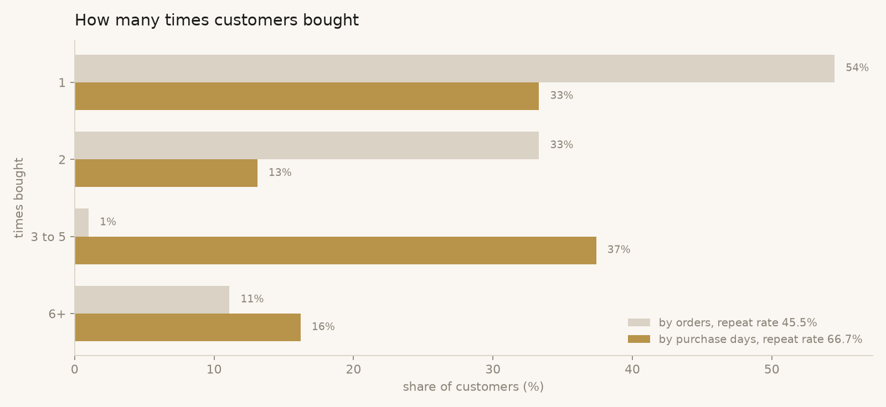
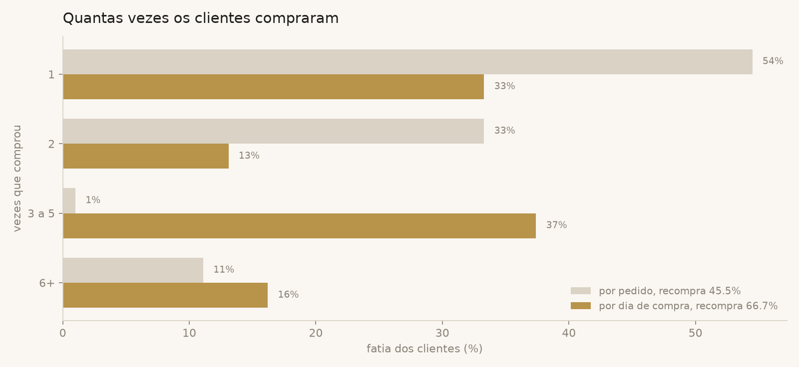

# 03 · How many customers come back?

**The sentence I gave the owner:** *"Out of every ten people who buy once,
six or seven buy again. The first number I got said four. Same data, same
question: I was counting the wrong thing."*



## Why this question

The repeat rate says whether the business is a bucket with a hole in it.
Getting a customer costs money (ads, samples, time in the chat); the second
purchase is where that money comes back. A business with a low repeat rate
has to keep buying customers forever.

## How it is answered

[`query.sql`](query.sql), in three steps:

1. **Per customer, two counts**: distinct orders and distinct purchase
   days, gifts excluded.
2. **The same customers under each unit**, side by side, with `union all`.
   One row per customer per unit.
3. **Buckets** (bought 1, 2, 3 to 5, 6 or more times) with `case`, then a
   window over each unit to get the share of customers in each bucket and
   the repeat rate (everyone outside the "1" bucket). `count(*) filter
   (where ...)` counts a subset without a second query.

## The catch: what is "coming back"?

In this business an order stays open while the customer keeps adding
decants to it, sometimes for weeks, and everything ships together. So a
customer who bought on five different days can be a single order. Count
orders and she "never came back". Count purchase days and she came back
four times.

The unit is a business decision, not a SQL one. Here the buying decision
is the day, so the purchase-day number is the real one. The query keeps
both so the gap is visible instead of silently picking one.

## Result on the synthetic data

| unit | bought once | 2 | 3 to 5 | 6+ | repeat rate |
|---|---|---|---|---|---|
| orders | 54% | 33% | 1% | 11% | **46%** |
| purchase days | 33% | 13% | 37% | 16% | **67%** |

- By purchase days, **67% of customers bought more than once**. By
  orders, 46%. Same 99 customers.
- The "3 to 5" bucket is where the difference lives: by orders it is
  almost empty (1%), by purchase days it is more than a third of the base. Those
  are the customers who buy on several days and ship once.

## What came out of it

- The owner now has one number to watch monthly: the purchase-day repeat
  rate. If it drops, the bucket is leaking, before revenue shows it.
- The lesson travelled: [analysis 02](../02-customers-going-quiet/) was
  rewritten to use purchase days for the same reason.

## Reproduce

```bash
python scripts/generate_data.py
python scripts/run_analysis.py 03-repeat-purchase-rate
```

---

## Em português



**A frase que eu dei pro dono:** *"De cada dez pessoas que compram uma vez,
seis ou sete compram de novo. O primeiro número que eu tirei dizia quatro.
Mesmo dado, mesma pergunta: eu estava contando a coisa errada."*

### Por que essa pergunta

A taxa de recompra diz se o negócio é um balde furado. Conseguir um cliente
custa (anúncio, amostra, tempo no chat); a segunda compra é onde esse
dinheiro volta. Negócio com recompra baixa precisa comprar cliente pra
sempre.

### Como é respondida

[`query.sql`](query.sql), em três passos:

1. **Por cliente, duas contagens**: pedidos distintos e dias de compra
   distintos, sem bônus.
2. **Os mesmos clientes em cada unidade**, lado a lado, com `union all`.
   Uma linha por cliente por unidade.
3. **Faixas** (comprou 1, 2, 3 a 5, 6 ou mais vezes) com `case`, e uma
   janela por unidade pra tirar a fatia de clientes em cada faixa e a taxa
   de recompra (todo mundo fora da faixa "1"). O `count(*) filter (where
   ...)` conta um subconjunto sem uma segunda consulta.

### A pegadinha: o que é "voltar"?

Neste negócio o pedido fica aberto enquanto o cliente vai juntando decants,
às vezes por semanas, e tudo vai junto. Então uma cliente que comprou em
cinco dias diferentes pode ser um pedido só. Contando pedidos, ela "nunca
voltou". Contando dias de compra, voltou quatro vezes.

A unidade é decisão de negócio, não de SQL. Aqui a decisão de compra é o
dia, então o número por dia de compra é o de verdade. A consulta guarda os
dois pra diferença ficar visível em vez de escolher um em silêncio.

### Resultado nos dados fictícios

- Por dia de compra, **67% dos clientes compraram mais de uma vez**. Por
  pedido, 46%. Os mesmos 99 clientes.
- A faixa "3 a 5" é onde mora a diferença: por pedido está quase vazia
  (1%), por dia de compra é mais de um terço da base. São os clientes que compram
  em vários dias e recebem de uma vez.

### O que saiu disso

- O dono passou a ter um número pra olhar por mês: a recompra por dia de
  compra. Se cair, o balde está vazando, antes de aparecer no faturamento.
- A lição viajou: a [análise 02](../02-customers-going-quiet/) foi
  reescrita pra usar dia de compra pelo mesmo motivo.
