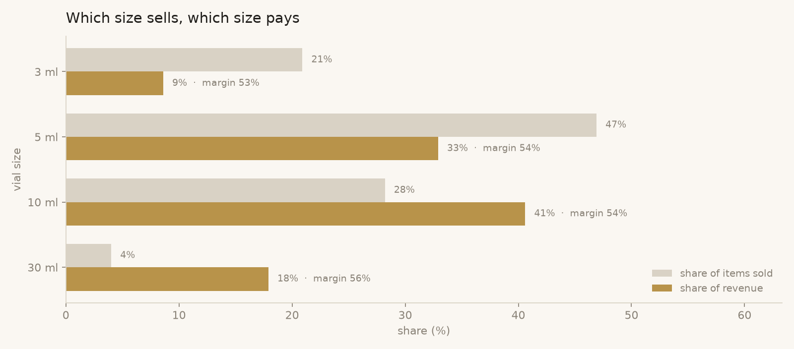
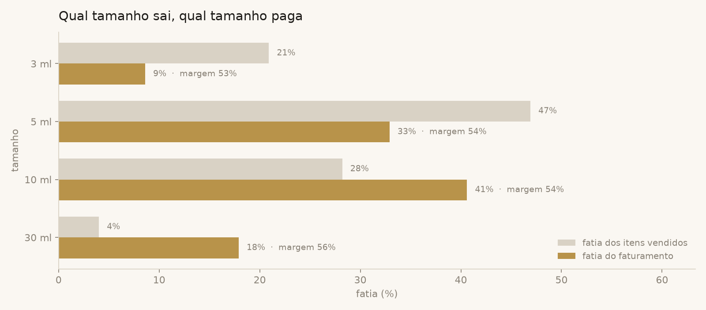

# 04 · Which vial size sells, and which one makes the money?

**The sentence I gave the owner:** *"Half of everything you sell is 5 ml,
so keep that shelf full. But the money is in the 10 ml: one item in four,
four reais in ten. And the 30 ml is one sale in twenty-five and almost one
real in five. Do not run out of the big sizes because they 'never sell'."*



## Why this question

Vials, labels and boxes are bought per size, and the owner restocks by
feel. "5 ml goes fast" is true, and it is also the wrong way to decide
what to keep in stock: the size that moves the most units and the size
that brings the most money are not the same thing. Running out of the
rare, expensive size costs more than running out of the common one.

## How it is answered

[`query.sql`](query.sql), in four steps:

1. **One row per sold item** with price and the cost stamped at sale time
   (perfume + vial + label). Gifts excluded.
2. **Group by size**: items, revenue, gross profit.
3. **Two shares against the whole table**: `count(*) / sum(count(*)) over
   ()` and the same for revenue. The window with an empty `over ()` is the
   grand total glued to every row, so each size can be compared with all
   the others in one pass.
4. **Margin per size** (`profit / revenue`), so a size that sells a lot at
   a thin margin cannot hide behind volume.

The chart puts the two shares side by side. When the grey bar is longer,
the size moves units; when the gold bar is longer, it moves money.

## Result on the synthetic data

| size | items | share of items | revenue | share of revenue | margin |
|---|---|---|---|---|---|
| 3 ml | 111 | 21% | 10,509.21 | 9% | 53% |
| 5 ml | 249 | **47%** | 40,308.15 | 33% | 54% |
| 10 ml | 150 | 28% | 49,684.10 | **41%** | 54% |
| 30 ml | 21 | 4% | 21,923.10 | 18% | 56% |

- **5 ml is half of the units and a third of the money.** It is the shelf
  that cannot be empty, but it is not the business.
- **10 ml is the business**: 28% of the items, 41% of the revenue.
- **30 ml is one item in twenty-five and almost one real in five.** A
  single lost 30 ml sale costs as much as eleven lost 3 ml sales.
- **3 ml moves a lot and pays little**: 21% of the work at the bench for
  9% of the revenue. The vial and the label weigh more in a small decant,
  which is why its margin is the lowest.

## What came out of it

- Restocking became two lists instead of one: by units (5 ml first) and
  by money (never below a safety stock of 30 ml).
- The 3 ml size is the candidate for a price review: same handling as a
  5 ml, smaller ticket, thinner margin.

## Reproduce

```bash
python scripts/generate_data.py
python scripts/run_analysis.py 04-vial-size-mix
```

---

## Em português



**A frase que eu dei pro dono:** *"Metade de tudo que você vende é 5 ml,
então essa prateleira não pode faltar. Mas o dinheiro está no 10 ml: um
item em quatro, quatro reais em dez. E o 30 ml é uma venda em vinte e
cinco e quase um real em cinco. Não deixa acabar os tamanhos grandes
porque eles 'nunca saem'."*

### Por que essa pergunta

Frasquinho, etiqueta e caixa se compram por tamanho, e o dono repõe no
sentimento. "O 5 ml sai rápido" é verdade, e também é o jeito errado de
decidir estoque: o tamanho que mais gira e o tamanho que mais traz
dinheiro não são o mesmo. Faltar o tamanho raro e caro custa mais que
faltar o comum.

### Como é respondida

[`query.sql`](query.sql), em quatro passos:

1. **Uma linha por item vendido**, com preço e o custo carimbado na hora
   da venda (perfume + frasquinho + etiqueta). Sem bônus.
2. **Agrupa por tamanho**: itens, faturamento, lucro bruto.
3. **Duas fatias contra a tabela inteira**: `count(*) / sum(count(*)) over
   ()` e o mesmo pro faturamento. A janela com `over ()` vazio é o total
   geral colado em cada linha, então cada tamanho se compara com todos os
   outros numa passada só.
4. **Margem por tamanho** (`lucro / faturamento`), pra um tamanho que vende
   muito com margem fina não se esconder atrás do volume.

O gráfico põe as duas fatias lado a lado. Barra cinza maior, o tamanho
gira unidade; barra dourada maior, gira dinheiro.

### Resultado nos dados fictícios

- **5 ml é metade das unidades e um terço do dinheiro.** É a prateleira
  que não pode ficar vazia, mas não é o negócio.
- **10 ml é o negócio**: 28% dos itens, 41% do faturamento.
- **30 ml é um item em vinte e cinco e quase um real em cinco.** Uma venda
  de 30 ml perdida custa o mesmo que onze de 3 ml.
- **3 ml gira muito e paga pouco**: 21% do trabalho na bancada por 9% do
  faturamento. Frasquinho e etiqueta pesam mais num decant pequeno, por
  isso a margem é a menor.

### O que saiu disso

- A reposição virou duas listas em vez de uma: por unidade (5 ml primeiro)
  e por dinheiro (nunca abaixo de um estoque de segurança de 30 ml).
- O 3 ml é o candidato a revisão de preço: mesmo trabalho de um 5 ml,
  tíquete menor, margem mais fina.
