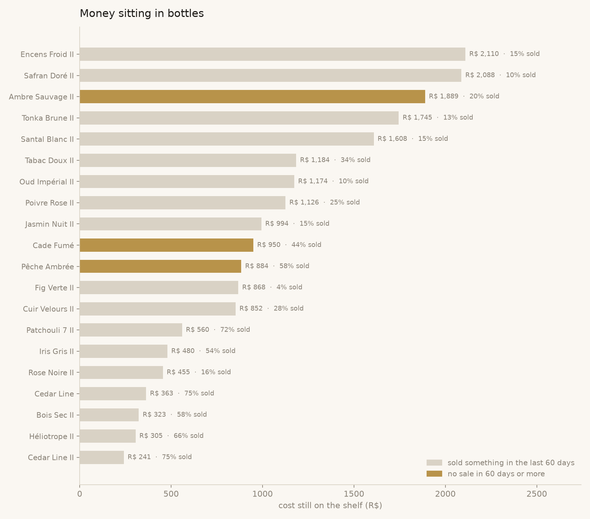
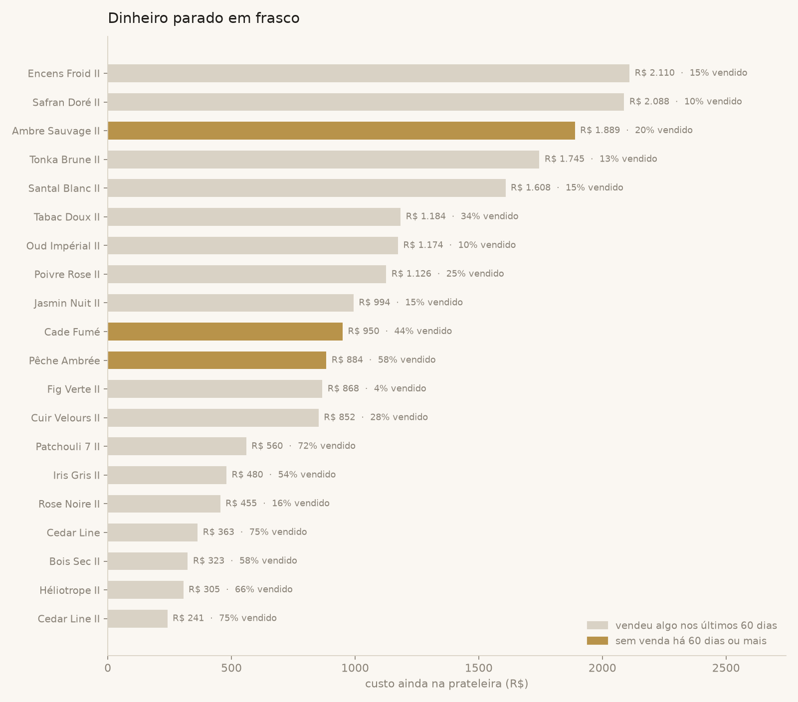

# 05 · How much money is sitting in bottles?

**The sentence I gave the owner:** *"There is R$ 21.8k of perfume on the
shelf, at cost, that has not turned into a sale yet. Most of it is the new
batch and that is fine. 6 bottles have not sold a single decant in two
months: R$ 3.8k that is not coming back on its own."*



## Why this question

Every bottle is cash paid up front that only comes back millilitre by
millilitre. A shelf full of half-sold bottles looks like stock; to the
bank account it is money that left and has not returned. Two questions
hide inside one: how much is sitting (a number), and which bottles
stopped moving (a list to act on: promote, bundle, or stop restocking).

## How it is answered

[`query.sql`](query.sql), in five steps:

1. **Per bottle, ml sold and last sale.** `left join` keeps bottles that
   never sold anything; a plain `join` would hide exactly the worst
   cases. Gifts consume perfume too, so they count here.
2. **ml left, cost sitting, revenue potential.** `greatest(volume - sold,
   0)` guards against a bottle that was topped up or measured loosely.
   Cost sitting uses the cost the business actually paid per ml.
3. **Days since the last sale**, with `coalesce(last_sale, created_at)`:
   a bottle that never sold is measured from the day it was registered.
4. **Share of all the money sitting**, with a window over the whole
   table, so the top rows read as "these five are 43% of the problem".
5. **Stalled = no sale in 60 days.** The threshold is a business choice;
   it is one number in the query.

In the chart, bar length is money at cost still on the shelf; gold bars
are the stalled ones.

## Result on the synthetic data

| bottle | ml left | sold | cost sitting | share | days since sale | stalled |
|---|---|---|---|---|---|---|
| Encens Froid II | 85 of 100 | 15% | 2,109.70 | 9.7% | 0 | no |
| Safran Doré II | 90 of 100 | 10% | 2,088.00 | 9.6% | 37 | no |
| Ambre Sauvage II | 80 of 100 | 20% | 1,888.80 | 8.7% | 62 | yes |
| Tonka Brune II | 87 of 100 | 13% | 1,745.22 | 8.0% | 10 | no |
| Santal Blanc II | 85 of 100 | 15% | 1,608.20 | 7.4% | 16 | no |
| ... | | | | | | |

- **R$ 21.8k sitting across 50 bottles**, and the top five hold 43% of it.
  They are all from the recent batch (the "II" bottles), so a low
  percentage sold is expected, not alarming.
- **6 bottles are stalled** (no sale in 60 days), R$ 3.8k at cost. Ambre Sauvage II
  is the one to look at first: 80 ml left and 62 days without a
  sale, in a batch where its neighbours are moving.
- Revenue potential is shown next to cost on purpose: the same 85 ml is
  R$ 2k of cost or R$ 5k of sales, and the owner thinks in the second.

## What came out of it

- The owner separates "new and slow" from "old and stopped". Only the
  second group gets action: a decant of the week, a bundle, or no
  restock.
- The number at the top (money sitting, at cost) became the one line the
  owner checks before buying a new bottle.

## Reproduce

```bash
python scripts/generate_data.py
python scripts/run_analysis.py 05-money-in-bottles
```

---

## Em português



**A frase que eu dei pro dono:** *"Tem R$ 21,8 mil de perfume na prateleira,
a preço de custo, que ainda não virou venda. A maior parte é o lote novo, e
isso é normal. 6 frascos não venderam um decant em dois meses: R$ 3,8 mil que
não vão voltar sozinhos."*

### Por que essa pergunta

Todo frasco é dinheiro pago adiantado que só volta mililitro por
mililitro. Prateleira cheia de frasco pela metade parece estoque; pra
conta bancária é dinheiro que saiu e não voltou. Duas perguntas moram
numa só: quanto está parado (um número) e quais frascos pararam de girar
(uma lista pra agir: promover, combinar, ou não repor).

### Como é respondida

[`query.sql`](query.sql), em cinco passos:

1. **Por frasco, ml vendidos e última venda.** O `left join` mantém frasco
   que nunca vendeu nada; um `join` comum esconderia justo os piores
   casos. Bônus consome perfume, então conta aqui.
2. **ml que sobrou, custo parado, receita possível.** O `greatest(volume -
   vendido, 0)` protege de frasco completado ou medido no olho. O custo
   parado usa o custo por ml que o negócio pagou de verdade.
3. **Dias desde a última venda**, com `coalesce(ultima_venda, cadastro)`:
   frasco que nunca vendeu conta a partir do dia em que entrou.
4. **Fatia de todo o dinheiro parado**, com janela sobre a tabela inteira,
   pra ler "esses cinco são 43% do problema".
5. **Parado = sem venda há 60 dias.** O corte é escolha de negócio; é um
   número só na consulta.

No gráfico, o comprimento da barra é o dinheiro a custo ainda na
prateleira; as douradas são as paradas.

### Resultado nos dados fictícios

- **R$ 21,8 mil parados em 50 frascos**, e os cinco maiores seguram 43% disso.
  São todos do lote recente (os "II"), então pouco vendido é esperado,
  não alarme.
- **6 frascos estão parados** (sem venda há 60 dias), R$ 3,8 mil a custo.
  Ambre Sauvage II é o primeiro a olhar: 80 ml sobrando e 62 dias sem
  venda, num lote em que os vizinhos estão girando.
- A receita possível aparece ao lado do custo de propósito: os mesmos
  85 ml são R$ 2 mil de custo ou R$ 5 mil de venda, e o dono pensa no
  segundo.

### O que saiu disso

- O dono separa "novo e lento" de "velho e parado". Só o segundo grupo
  ganha ação: decant da semana, combo, ou não repor.
- O número do topo (dinheiro parado, a custo) virou a linha que o dono
  olha antes de comprar frasco novo.
